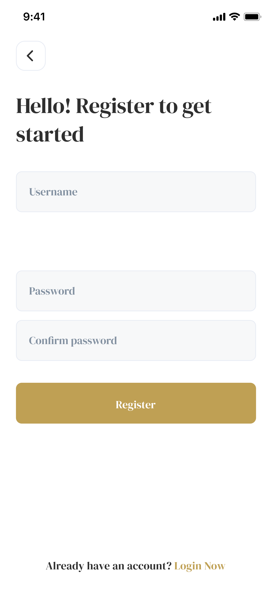

# 📚 Bookia

**Bookia** is a complete bookstore app that lets you discover, purchase, and read books with ease. Whether you love novels, educational books, self-development, or any other genre, **Bookia** offers a vast library of titles right at your fingertips.

---

## ✨ Features

* 🔍 **Easy Browsing**: Search for your favorite books or explore categories effortlessly
* ⚡ **Instant Purchase & Read**: Get your digital copy immediately
* ❤️ **Personalized Lists**: Save favorites and build your own library
* 🎨 **Smooth UI/UX**: Clean and user-friendly design

---

## 📸 Screenshots

<p align="center">
  
  
</p>

<p align="center">
  
  
</p>

---

## 🛠️ Tech Stack

* **Flutter**
* **Dart**
* **Bloc / Cubit** (State Management)
* **REST API**

---

## 🚀 Getting Started

### Prerequisites

* Flutter SDK
* Android Studio / VS Code
* Emulator or real device

---

### Installation

```bash
git clone https://github.com/your-username/bookia.git
cd bookia
flutter pub get
```

---

### Run the App

```bash
flutter run
```

---

## 📂 Project Structure

```
lib/
│── core/            # Shared resources (themes, widgets, utils)
│── features/        # App features (auth, home, books, etc.)
│── main.dart        # Entry point
```

---

## ⚙️ Build Release

```bash
flutter build apk --release
```

---

## 🤝 Contributing

Contributions are welcome! Feel free to fork the repo and submit a pull request.

---

## 📄 License

This project is for educational purposes.

---

